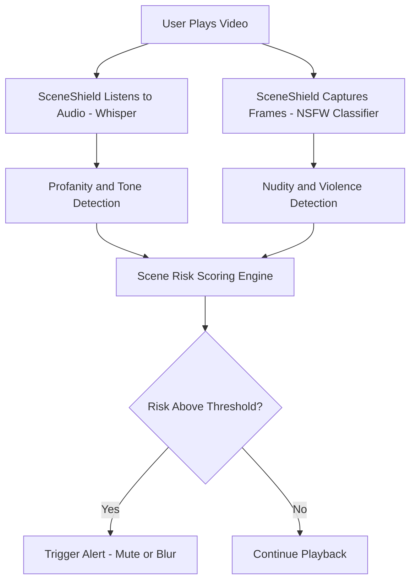

# 🎬 SceneShield AI

[](https://github.com/emcdo411/sceneshield-ai/actions/workflows/build.yml)


> "A Safer Screen Without Censorship."

SceneShield AI is a smart React Native prototype designed to **detect and warn about inappropriate movie or TV scenes before they appear**. Built with AI-powered scene and audio analysis, it gives users real-time alerts for moments of violence, nudity, profanity, and more — without sacrificing adult storytelling.

---

## 🚀 Live Preview (Coming Soon)

Stay tuned for the first MVP release! You can follow development progress here:
🔗 [https://github.com/emcdo411/sceneshield-ai](https://github.com/emcdo411/sceneshield-ai)

---

## 🛠️ Tech Stack


---

## 📦 Installed Packages

```bash
- react
- react-dom
- typescript
- vite
- tailwindcss
- postcss
- eslint
```

---

## 📂 Folder Structure

```bash
sceneshield-ai/
├── .gitignore
├── README.md
├── components.json
├── eslint.config.js
├── index.html
├── package.json
├── package-lock.json
├── postcss.config.js
├── public/
├── src/
├── tailwind.config.ts
├── tsconfig.json
├── tsconfig.app.json
├── tsconfig.node.json
├── vite.config.ts
└── DACR_LICENSE/
    └── LICENSE.md
```

---

## 📈 Architecture Flow (Mermaid)



```

---

## 🧪 How It Works

* Accepts audio + screen input (local file, Chromecast, or live playback)
* Transcribes audio in real-time using OpenAI Whisper
* Uses image classification (e.g., NSFW\.js or YOLOv5) for nudity, weapons, and violence
* Scores scenes and provides alerts 10–15 seconds ahead

---

## 📌 CMD Setup Script

```bash
:: STEP 1: Initialize Git and connect to GitHub repo
cd sceneshield-ai
git init
git remote add origin https://github.com/emcdo411/sceneshield-ai.git

:: STEP 2: Stage and push project files
git add .
git commit -m "Initial commit for SceneShield AI prototype"
git branch -M main
git push -u origin main
```

---

## 🧠 Why This Matters

SceneShield AI is not about censorship. It’s about **context, control, and care**. With today’s media landscape, families deserve tools that support mindful viewing without losing the integrity of storytelling.

---

## 👋 Want to Contribute?

Fork the repo, create a feature branch, and submit a PR. Feedback and collaborations are always welcome.

---

## 📣 Credit

Prompt generated via **LoomismAppAI.com** and developed by [@emcdo411](https://github.com/emcdo411).

---

## 🛡 DACR LICENSE

This project is licensed under the **Defensive AI Commercial Rights (DACR)** License.

> The DACR License allows for broad creative use while placing ethical restrictions on misuse, including but not limited to:
>
> * Use for surveillance or behavioral manipulation
> * Deployment in carceral, military, or predictive policing environments
> * Resale as a closed-source or DRM-restricted tool

This license promotes **accountable AI development** and ensures this project cannot be used to violate civil liberties or human dignity.

See the full DACR terms inside the `DACR_LICENSE/LICENSE.md` file.
 
